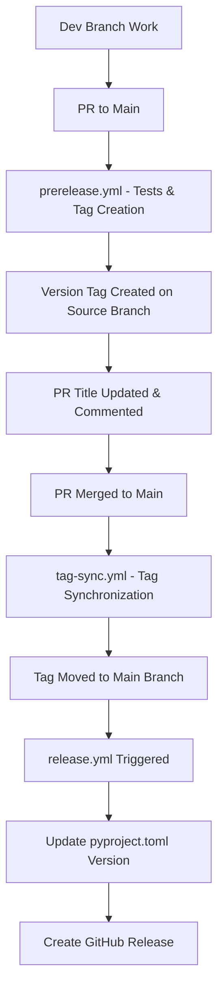

# GitHub Actions Workflow Documentation

This document describes the GitHub Actions workflows used in JuliaPkgTemplatesCLI for automated testing and release management.

## Workflow Overview

The project uses a three-workflow release system:

1. **Pre-release Preparation**: When a PR is opened to `main`, tests are run, version is determined, and a tag is created on the source branch
2. **Tag Synchronization**: When the PR is merged to `main`, tags are synced from the dev branch to main
3. **Release Creation**: When a version tag is pushed, a GitHub release is created

## Workflow Files

### 1. `prerelease.yml` - Prepare Release PR
**Purpose**: Runs tests, determines next version, and prepares release tags for PRs targeting main

**Triggers**:
- Pull requests opened, ready for review, or synchronized targeting `main` branch
- Manual dispatch with PR number input

**Key Actions**:
- Runs full test suite and type checking
- Uses semantic-release to determine the next version
- Updates PR title to include version (only for PRs with "release" in title)
- Creates a version tag on the source branch
- Comments on PR with version information

**Conditions**:
- Only runs on non-draft PRs
- Requires fetch-depth: 0 for full git history
- PR title update only occurs if PR title contains "release"

**Key Steps**:
1. **Test Suite**: Runs pytest and pyright type checking
2. **Version Analysis**: Compares current main branch version with semantic-release calculated version
3. **Update PR Title**: Updates title to format `release: v{version}` if "release" is in current title
4. **Create Tag**: Creates `v{version}` tag on the source branch and pushes it
5. **Comment**: Adds comment with version information to the PR

### 2. `tag-sync.yml` - Tag Synchronization
**Purpose**: Synchronizes version tags from dev branch to main branch after merge

**Triggers**:
- Push to `main` branch (excluding chore/ci commits)

**Key Actions**:
- Finds the latest version tag
- Moves the tag to point to the current main branch commit
- Triggers the release workflow manually after tag synchronization

**Conditions**:
- Skips for commits with "chore(ci)", "chore:", or "ci:" in commit message
- Only runs when version tags exist

**Key Steps**:
1. **Fetch Tags**: Retrieves all version tags from repository
2. **Find Latest**: Identifies the most recent version tag
3. **Sync Tag**: Moves tag from source branch to main branch commit
4. **Trigger Release**: Manually triggers release workflow for the synced tag

### 3. `release.yml` - GitHub Release Creation
**Purpose**: Creates GitHub releases when version tags are pushed

**Triggers**:
- Push of version tags (pattern: `v*`)

**Key Actions**:
- Updates `pyproject.toml` version to match the tag
- Creates GitHub release using semantic-release
- Commits version update to main branch

**Key Steps**:
1. **Extract Version**: Gets version number from the pushed tag
2. **Update Project Version**: Synchronizes `pyproject.toml` version with tag
3. **Create Release**: Uses semantic-release to generate GitHub release
4. **Commit Changes**: Commits version update to main branch

## Workflow Dependencies and Flow



## Configuration Details

### Semantic Release Configuration
Located in `pyproject.toml`:

```toml
[tool.semantic_release]
version_toml = ["pyproject.toml:project.version"]
build_command = "uv build"
upload_to_pypi = false
upload_to_release = true
tag_format = "v{version}"
major_on_zero = false
allow_zero_version = true

[tool.semantic_release.branches.main]
match = "main"

[tool.semantic_release.branches.dev]
match = "dev"

[tool.semantic_release.commit_parser_options]
minor_tags = ["feat"]
patch_tags = ["fix", "perf", "refactor"]

[tool.semantic_release.changelog]
exclude_commit_patterns = ["chore:", "ci:", "test:", "docs:", "style:"]
```

### Branch Strategy
- **main**: Production branch, receives releases
- **dev**: Development branch, where version tags are initially created
- Version tags format: `v{version}` (e.g., `v0.1.0`)

## Release Process

### 1. Normal Feature Releases
1. Develop features on `dev` branch
2. Open PR to `main` with "release" in the title → triggers `prerelease.yml` (tests, version determination, tag creation)
3. Review and test the changes
4. Merge PR → triggers `tag-sync.yml` (moves tag to main) → triggers `release.yml` (creates GitHub release)

### 2. Hotfix Releases (Direct to Main)
1. Create version tag manually on `main` branch
2. Push tag → triggers `release.yml` directly to create GitHub release
3. No tag synchronization needed for direct main branch tags

## Permissions

Workflows use these permissions:
- `contents: write` - For creating tags, releases, and committing version updates
- `pull-requests: write` - For updating PR titles and comments
- `id-token: write` - For GitHub Actions authentication

## Key Features

### Version Management
- **Automatic Version Detection**: Uses semantic-release to determine next version based on conventional commits
- **Version Synchronization**: Automatically updates `pyproject.toml` version to match release tags
- **Tag Strategy**: Creates version tags on source branch, then syncs to main during release

### PR Management
- **Title Updates**: Automatically updates PR titles to include version information
- **Version Comments**: Adds informative comments to PRs with version details
- **Draft Handling**: Skips processing for draft PRs

### Testing Integration
- **Testing in PR Phase**: Tests run during `prerelease.yml` before tag creation
- **Python Testing**: Tests against Python 3.11 using pytest
- **Type Checking**: Runs pyright for static type analysis on src/juliapkgtemplates/
- **Early Validation**: Tests must pass before version tags are created

## Error Handling

- **No Version Changes**: `prerelease.yml` skips tag creation if no version change detected
- **Failed Tests**: Tag creation only proceeds if tests pass in `prerelease.yml`
- **Tag Conflicts**: `tag-sync.yml` uses latest tag for synchronization
- **Tag Movement**: Tags are safely deleted and recreated during synchronization
- **Chore Commits**: `tag-sync.yml` skips for chore/ci commits to avoid unnecessary processing

## Best Practices

1. **PR Titles**: Include "release" in PR titles to trigger title updates
2. **Conventional Commits**: Use conventional commit format for automatic versioning
3. **Testing**: All tests must pass before release
4. **Version Consistency**: Workflows maintain consistency between tags and `pyproject.toml`

## Troubleshooting

### Common Issues
1. **Version Not Determined**: Check if commits follow conventional commit format
2. **PR Title Not Updated**: Ensure PR title contains "release"
3. **Release Skipped**: Verify that version tags exist and are accessible
4. **Test Failures**: Check test output and Julia dependency installation

### Debug Commands
```bash
# Check latest tags and their commits
git tag -l "v*" --sort=-version:refname | head -5
git show --format="%H %s" $(git tag -l "v*" --sort=-version:refname | head -1)

# Verify version in pyproject.toml
grep version pyproject.toml

# Test semantic-release version detection
uv run semantic-release version --print

# Check workflow run history
gh run list --workflow=prerelease.yml
gh run list --workflow=tag-sync.yml
gh run list --workflow=release.yml
```

## PyPI Publishing

PyPI publishing is currently disabled (`upload_to_pypi = false` in configuration). To enable:

1. Uncomment the PyPI publishing steps in `release.yml`
2. Set up PyPI credentials in repository secrets
3. Update semantic-release configuration if needed