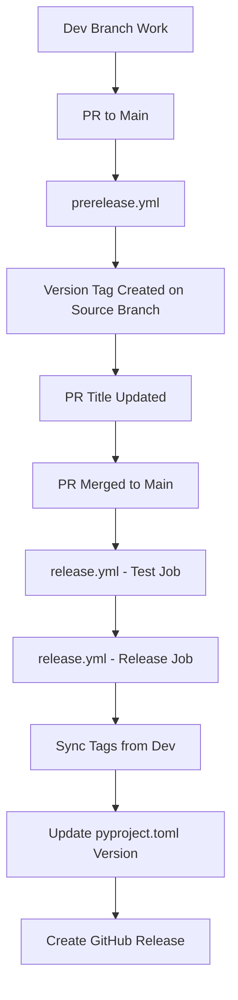

# GitHub Actions Workflow Documentation

This document describes the GitHub Actions workflows used in JuliaPkgTemplatesCLI for automated testing and release management.

## Workflow Overview

The project uses a simple two-workflow release system:

1. **Development Phase**: Features are developed on the `dev` branch
2. **Pre-release Preparation**: When a PR is opened to `main`, the version is determined and a tag is created on the source branch
3. **Release**: When the PR is merged to `main`, the tag is synced and a GitHub release is created

## Workflow Files

### 1. `prerelease.yml` - Prepare Release PR
**Purpose**: Prepares release PRs by determining the next version and creating tags

**Triggers**:
- Pull requests opened, ready for review, or synchronized targeting `main` branch
- Manual dispatch with PR number input

**Key Actions**:
- Uses semantic-release to determine the next version without creating releases
- Updates PR title to include version (only for PRs with "release" in title)
- Creates a version tag on the source branch
- Comments on PR with version information

**Conditions**:
- Only runs on non-draft PRs
- Requires fetch-depth: 0 for full git history
- PR title update only occurs if PR title contains "release"

**Key Steps**:
1. **Get Next Version**: Uses `semantic-release version --print` to determine version
2. **Update PR Title**: Updates title to format `release: v{version}` if "release" is in current title
3. **Create Tag**: Creates `v{version}` tag on the source branch and pushes it
4. **Comment**: Adds comment with version information to the PR

### 2. `release.yml` - Release
**Purpose**: Main release workflow that handles testing and GitHub release creation

**Triggers**:
- Push to `main` branch
- Manual dispatch

**Key Components**:

#### Test Job
- **Matrix Strategy**: Runs on Python 3.11 and 3.12
- **Julia Setup**: Sets up Julia 1.10 and installs PkgTemplates.jl
- **Test Execution**: Runs pytest with verbose output
- **Type Checking**: Executes pyright on src/juliapkgtemplates/
- **Required**: Must pass before release job runs

#### Release Job
- **Tag Synchronization**: Fetches tags from dev branch and finds latest version tag
- **Version Update**: Updates `pyproject.toml` version to match the latest tag
- **Release Creation**: Uses semantic-release to create GitHub release
- **Commit**: Commits version update to main branch

**Conditions**:
- Release job only runs on push to main or manual dispatch
- Skips if no version tags are found
- Uses concurrency control to prevent parallel releases

## Workflow Dependencies and Flow



## Configuration Details

### Semantic Release Configuration
Located in `pyproject.toml`:

```toml
[tool.semantic_release]
version_toml = ["pyproject.toml:project.version"]
build_command = "uv build"
upload_to_pypi = false
upload_to_release = true
tag_format = "v{version}"
major_on_zero = false
allow_zero_version = true

[tool.semantic_release.branches.main]
match = "main"

[tool.semantic_release.branches.dev]
match = "dev"

[tool.semantic_release.commit_parser_options]
minor_tags = ["feat"]
patch_tags = ["fix", "perf", "refactor"]

[tool.semantic_release.changelog]
exclude_commit_patterns = ["chore:", "ci:", "test:", "docs:", "style:"]
```

### Branch Strategy
- **main**: Production branch, receives releases
- **dev**: Development branch, where version tags are initially created
- Version tags format: `v{version}` (e.g., `v0.1.0`)

## Release Process

### 1. Normal Feature Releases
1. Develop features on `dev` branch
2. Open PR to `main` with "release" in the title → triggers version determination and tag creation
3. Review and test the changes
4. Merge PR → triggers release workflow that syncs tags and creates GitHub release

### 2. Hotfix Releases (Direct to Main)
1. Make hotfix commit directly to `main` branch
2. Release workflow will find the latest tag and create release
3. Manual version tag creation may be needed for hotfixes

## Permissions

Workflows use these permissions:
- `contents: write` - For creating tags, releases, and committing version updates
- `pull-requests: write` - For updating PR titles and comments
- `id-token: write` - For GitHub Actions authentication

## Key Features

### Version Management
- **Automatic Version Detection**: Uses semantic-release to determine next version based on conventional commits
- **Version Synchronization**: Automatically updates `pyproject.toml` version to match release tags
- **Tag Strategy**: Creates version tags on source branch, then syncs to main during release

### PR Management
- **Title Updates**: Automatically updates PR titles to include version information
- **Version Comments**: Adds informative comments to PRs with version details
- **Draft Handling**: Skips processing for draft PRs

### Testing Integration
- **Multi-Python Testing**: Tests against Python 3.11 and 3.12
- **Julia Integration**: Sets up Julia environment and installs PkgTemplates.jl
- **Type Checking**: Runs pyright for static type analysis
- **Release Gating**: Release only proceeds if all tests pass

## Error Handling

- **No Version Changes**: Workflow skips release if no version tags found
- **Failed Tests**: Release job depends on test job success
- **Tag Conflicts**: Uses latest tag for version synchronization
- **Permission Issues**: Uses `secrets.GITHUB_TOKEN` with appropriate scopes

## Best Practices

1. **PR Titles**: Include "release" in PR titles to trigger title updates
2. **Conventional Commits**: Use conventional commit format for automatic versioning
3. **Testing**: All tests must pass before release
4. **Version Consistency**: Workflows maintain consistency between tags and `pyproject.toml`

## Troubleshooting

### Common Issues
1. **Version Not Determined**: Check if commits follow conventional commit format
2. **PR Title Not Updated**: Ensure PR title contains "release"
3. **Release Skipped**: Verify that version tags exist and are accessible
4. **Test Failures**: Check test output and Julia dependency installation

### Debug Commands
```bash
# Check latest tags
git tag --sort=version:refname | tail -5

# Verify version in pyproject.toml
grep version pyproject.toml

# Test semantic-release version detection
uv run semantic-release version --print
```

## PyPI Publishing

PyPI publishing is currently disabled (`upload_to_pypi = false` in configuration). To enable:

1. Uncomment the PyPI publishing steps in `release.yml`
2. Set up PyPI credentials in repository secrets
3. Update semantic-release configuration if needed