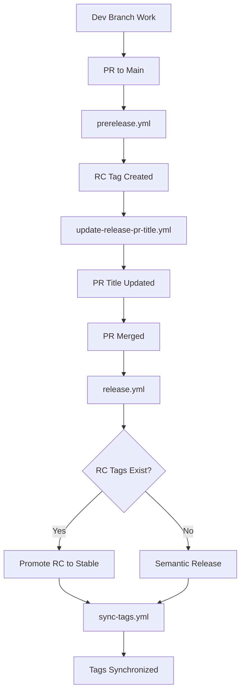

# GitHub Actions Workflow Documentation

This document describes the GitHub Actions workflows used in JuliaPkgTemplatesCLI for automated testing, release management, and deployment.

## Workflow Overview

The project uses a two-stage release workflow with Release Candidate (RC) promotion:

1. **Development Phase**: Features are developed on the `dev` branch
2. **RC Creation**: When a PR is opened to `main`, RC tags are created for testing
3. **Release Promotion**: When the PR is merged, the RC is promoted to a stable release

## Workflow Files

### 1. `prerelease.yml` - Create RC Tag
**Purpose**: Creates Release Candidate tags for testing before merging to main

**Triggers**:
- Pull requests opened or ready for review targeting `main` branch
- Manual dispatch with PR number input

**Key Actions**:
- Runs on `dev` branch commits
- Uses semantic-release to create RC tags (e.g., `v0.1.0-rc.1`)
- Comments on PR with the created RC tag
- Enables testing of changes before final release

**Conditions**:
- Only runs on non-draft PRs
- Requires fetch-depth: 0 for full git history

### 2. `update-release-pr-title.yml` - Update Release PR Title
**Purpose**: Automatically updates PR titles to include version information

**Triggers**:
- Pull requests opened or synchronized targeting `main` branch

**Key Actions**:
- Detects PRs with "release" in the title
- Extracts version from latest RC tag
- Updates PR title to format: "release: v{version}"

**Conditions**:
- Only runs if PR title contains "release"
- Requires RC tags to exist for version extraction

### 3. `release.yml` - Release
**Purpose**: Main release workflow that handles both RC promotion and hotfix releases

**Triggers**:
- Push to `main` branch
- Pull requests targeting `main` (for testing)
- Manual dispatch with branch selection

**Key Components**:

#### Test Job
- Runs on Python 3.11 and 3.12
- Sets up Julia 1.10 and installs PkgTemplates.jl
- Executes pytest and pyright type checking
- Required to pass before release job runs

#### Release Job
- **RC Promotion Strategy**: Promotes latest RC tag to stable release
  - Finds latest RC tag (e.g., `v0.1.0-rc.2`)
  - Creates stable tag (e.g., `v0.1.0`)
  - Updates `pyproject.toml` version
  - Creates GitHub release with generated notes
  
- **Semantic Release Fallback**: For hotfixes without RC tags
  - Runs semantic-release for patch releases
  - Handles direct commits to main branch

**Conditions**:
- Release job only runs on push to main or manual dispatch
- Strategy determined by presence of RC tags

### 4. `sync-tags.yml` - Sync Tags
**Purpose**: Ensures tag visibility across branches after releases

**Triggers**:
- Runs after successful completion of Release workflow

**Key Actions**:
- Fetches all tags from remote
- Pushes tags to ensure availability for future dev branches
- Post-release cleanup and synchronization

**Conditions**:
- Only runs if Release workflow completed successfully

## Workflow Dependencies and Flow



## Configuration Details

### Semantic Release Configuration
Located in `pyproject.toml`:

```toml
[tool.semantic_release]
version_toml = ["pyproject.toml:project.version"]
build_command = "uv build"
upload_to_pypi = false
upload_to_release = true
tag_format = "v{version}"
major_on_zero = false
allow_zero_version = true

[tool.semantic_release.branches.main]
match = "main"

[tool.semantic_release.branches.dev]
match = "dev"
prerelease = true
prerelease_token = "rc"

[tool.semantic_release.commit_parser_options]
minor_tags = ["feat"]
patch_tags = ["fix", "perf", "refactor"]

[tool.semantic_release.changelog]
exclude_commit_patterns = ["chore:", "ci:", "test:", "docs:", "style:"]
```

### Branch Strategy
- **main**: Production branch, receives promoted releases
- **dev**: Development branch, creates RC tags
- RC tags format: `v{version}-rc.{number}` (e.g., `v0.1.0-rc.1`)
- Stable tags format: `v{version}` (e.g., `v0.1.0`)

## Release Types

### 1. Feature Releases (via RC Promotion)
1. Develop features on `dev` branch
2. Open PR to `main` → triggers RC creation
3. Test RC version
4. Merge PR → promotes RC to stable release

### 2. Hotfix Releases (Direct to Main)
1. Make hotfix commit directly to `main`
2. Release workflow uses semantic-release fallback
3. Creates patch version automatically

## Permissions

All workflows use minimal required permissions:
- `contents: write` - For creating tags and releases
- `pull-requests: write` - For updating PR titles and comments
- `id-token: write` - For GitHub Actions authentication

## Error Handling

- **RC Promotion**: Falls back to semantic-release if RC tag already promoted
- **Tag Conflicts**: Checks for existing stable versions before promotion
- **Failed Tests**: Release job depends on test job success
- **Permission Issues**: Uses `secrets.GITHUB_TOKEN` with appropriate scopes

## Best Practices

1. **Testing**: Always test RC versions before merging to main
2. **Version Consistency**: Workflows automatically maintain version consistency in `pyproject.toml`
3. **Release Notes**: Generated automatically from conventional commits
4. **Tag Management**: RC tags are preserved for audit trail
5. **Rollback**: Can manually create hotfix releases if needed

## Troubleshooting

### Common Issues
1. **RC Creation Fails**: Check if `dev` branch has new commits since last RC
2. **Release Skipped**: Verify PR title contains "release" for title updates
3. **Version Mismatch**: Check `pyproject.toml` version against latest tags
4. **Permission Denied**: Ensure `GITHUB_TOKEN` has required permissions

### Debug Commands
```bash
# Check tag sequence
git tag --sort=version:refname

# Verify RC tags
git tag -l "*-rc.*" --sort=-version:refname

# Check version consistency
grep version pyproject.toml
```